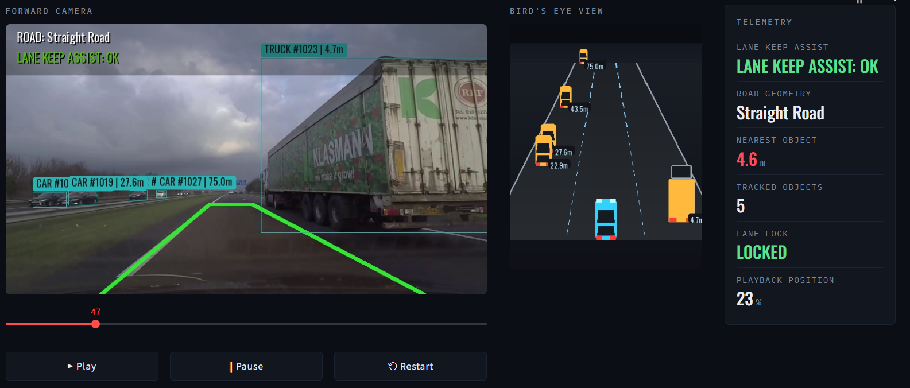

# ADAS Telemetry Console

A real-time driver-assistance dashboard that turns any dashcam video into a
full instrument cluster: lane detection, vehicle tracking, distance
estimation, collision warnings, and a pseudo-3D chase-camera view — all
running in your browser.


---

## What it does

Feed it a video file and the console reconstructs what an ADAS (Advanced
Driver Assistance System) would see and decide, frame by frame:

- **Lane detection** — finds and smooths the road's left/right boundaries
  using edge detection + Hough transforms, with temporal averaging so the
  lane overlay doesn't jitter.
- **Lane departure warning** — flags when the vehicle drifts toward either
  lane line, and classifies the road as straight or curving.
- **Object tracking** — detects and tracks cars, trucks, buses, motorcycles,
  and pedestrians frame-to-frame using YOLO + ByteTrack.
- **Distance estimation** — monocular distance-to-object using known vehicle
  widths and a calibrated focal length.
- **Collision warnings** — anything inside your lane and closer than the
  safety threshold triggers a `BRAKE NOW` alert.
- **Pseudo-3D chase view** — a perspective bird's-eye visualization that
  places every tracked vehicle in its correct lane, scaled by distance.
- **Telemetry rail** — a gauge-style readout of lane status, road geometry,
  nearest object distance, tracked object count, and playback position.
- **Frame-accurate scrubbing** — drag the slider to jump anywhere in the
  video; detection and lane overlays re-render for that exact frame.

---

## Demo

>
> 

---

## How it works

```
Raw frame
   │
   ├─► YOLO + ByteTrack ──► tracked vehicles (class, box, track ID)
   │                              │
   ├─► Edge detection + Hough ──► lane line equations (smoothed)
   │                              │
   ▼                              ▼
Lane polygon  ◄──────────────────┘
   │
   ├─► distance estimation (per object, from box width)
   ├─► in-lane / off-lane / critical classification
   ├─► HUD overlay (lane status, curve direction, brake alert)
   └─► pseudo-3D chase view + telemetry rail
```

Detection runs on the **clean, unprocessed frame** before any overlay is
drawn — so lane graphics never interfere with what the model sees. The same
detections then feed both the annotated video overlay and the chase-view
visualization, so the two views always agree on where things are.

### Key building blocks

| Component | What it does |
|---|---|
| `find_lane_segments` / `LaneState` | Canny edge detection + Hough transform inside a trapezoidal ROI, with a rolling average to smooth lane lines across frames |
| `process_frame` | The per-frame pipeline: detection → lane geometry → annotation → HUD → chase view |
| `estimate_distance_m` | Monocular distance estimate from bounding box width and known real-world vehicle dimensions |
| `lateral_position_in_lane` / `project_to_chase_view` | Maps each tracked object's screen position into lane-relative coordinates, then projects it onto the perspective chase canvas |
| `render_bev` | Draws the full chase-camera scene — sky/road gradient, vanishing-point road, lane dividers, vehicles scaled by depth |
| `render_telemetry_rail` | Renders the live gauge cluster (lane lock, road geometry, nearest object, object count, playback position) |

---

## Getting started

### 1. Clone the repo

```bash
git clone https://github.com/ansonmatt/adas-dashboard.git
cd adas-dashboard
```

### 2. Set up a virtual environment

```bash
python3 -m venv .venv
source .venv/bin/activate   # Windows: .venv\Scripts\activate
```

### 3. Install dependencies

```bash
pip install -r requirements.txt
```

### 4. Get a YOLO model

Download or place a YOLO weights file (e.g. `yolo26n.pt`) in the project
root. Any Ultralytics-compatible detection model will work — swap the
filename in `load_model()` if you're using a different one.

### 5. Get the display font (optional)

The dashboard looks for `Oswald-VariableFont_wght.ttf` in the project root
for HUD and telemetry text. It's not required — if missing, the app falls
back to a default font — but for the full intended look:

```bash
curl -L -o Oswald-VariableFont_wght.ttf \
  "https://github.com/google/fonts/raw/main/ofl/oswald/Oswald%5Bwght%5D.ttf"
```

### 6. Add a video

Drop a dashcam clip into `videos/` (or anywhere on disk).

### 7. Run it

```bash
streamlit run adas_dashboard.py
```

Enter the path to your video in the **Video source** panel, hit **Load
video**, then **Play**. Use the slider to scrub to any frame while paused.

---

## Configuration

A handful of constants near the top of `adas_dashboard.py` control behavior:

```python
ADAS_CLASSES = [0, 2, 3, 5, 7]   # COCO class IDs: person, car, motorcycle, bus, truck
COLLISION_DISTANCE_M = 15.0      # distance threshold for a critical/brake alert
LANE_DEVIATION_PX = 30           # pixel threshold for lane departure warnings
FRAME_SIZE = (854, 480)          # processing resolution
VEHICLE_WIDTHS_M = {...}         # real-world widths used for distance estimation
ASSUMED_FOCAL_LENGTH = 750       # calibration constant — tune for your footage
```

`ASSUMED_FOCAL_LENGTH` is the main one worth tuning: it's calibrated against
the sample footage, and distance estimates will drift if your video's camera
has a noticeably different field of view.

---

## Roadmap

- [ ] Webcam / live stream input
- [ ] Configurable detection classes from the UI
- [ ] Export annotated video + telemetry log
- [ ] Adjustable collision distance and lane sensitivity from the sidebar
- [ ] Multi-lane awareness (adjacent lane traffic in the chase view)

---

## Tech stack

- [Streamlit](https://streamlit.io) — UI and app framework
- [Ultralytics YOLO](https://github.com/ultralytics/ultralytics) + ByteTrack — object detection and tracking
- [OpenCV](https://opencv.org) — video I/O, edge detection, Hough transforms
- [Pillow](https://python-pillow.org) — HUD, telemetry, and chase-view rendering
- [NumPy](https://numpy.org) — lane geometry and projection math

---

## License

MIT — do whatever you want with it, just don't use it as the safety system
in an actual vehicle.
